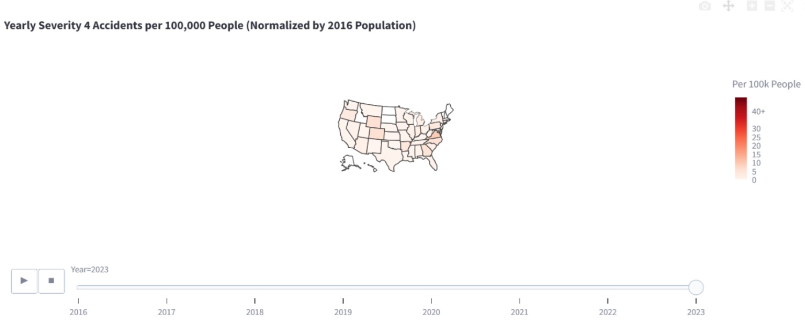
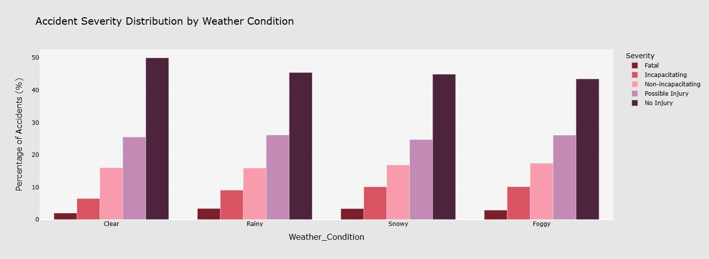
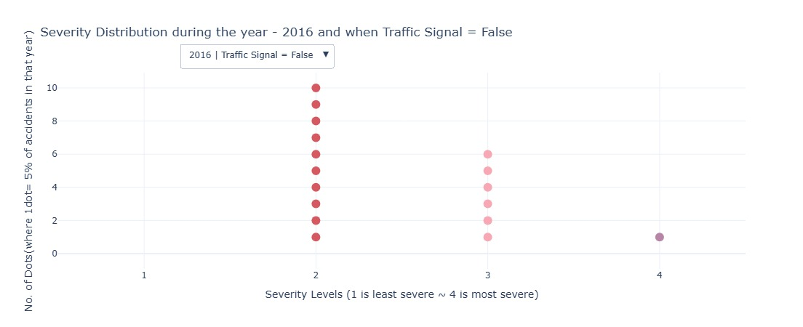
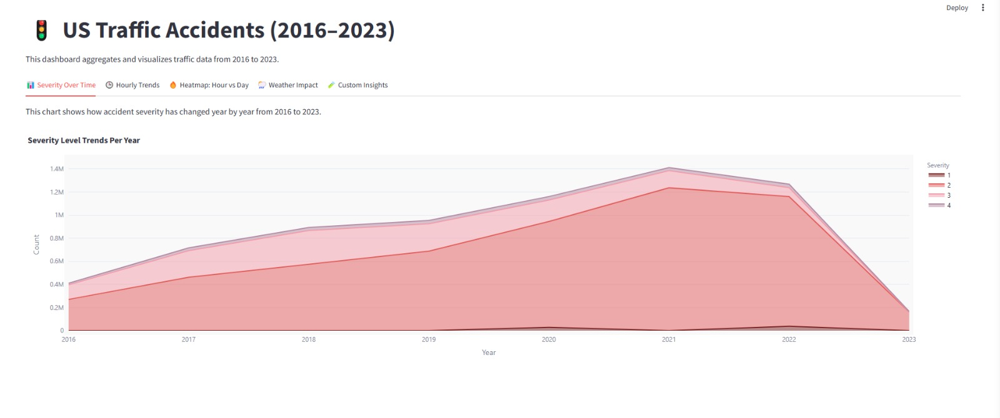
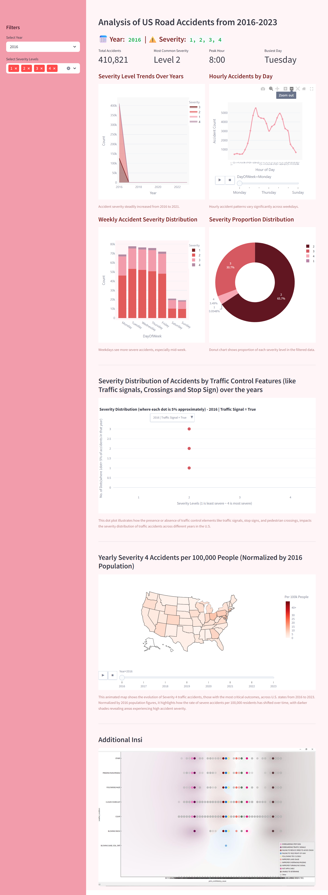

# 📊 Data Visualization Final Project

## Project Overview
The US Accidents Dashboard is an interactive data visualization application built to analyze and uncover insights from over 2.25 million accident records across the United States. Leveraging the power of **Dash, Plotly, and Pandas**, this project transforms raw accident datasets into meaningful visual narratives for public safety analysis and informed decision-making.

The application enables users to identify accident-prone areas, analyze contributing weather and infrastructure factors, and visualize the trends from 2016 to 2023.

## Motivation & Problem Statement
While statistical methods exist for examining accident data, they often fall short of being intuitive for public use. This project addresses that gap by utilizing data visualization to:

- Assess the impact of infrastructure on severity

- Offer an accessible dashboard to different user groups

Despite existing safety efforts, traffic accidents remain prevalent due to poor weather, road conditions, and human error. Traditional accident datasets often bury useful insights. **This project transforms these datasets into rich, interactive visual formats to guide data-driven road safety initiatives.**


## Project Structure
```
📁 DATA_VISUALIZATION_FINAL_PROJECT
├── assets/  
├── Vizs/
│   ├── firstviz.py
│   ├── secondviz.py
│   ├── thirdviz.py
│   ├── fourthviz.py
│   └── fifthviz.py
├── Dashboard.py
├── Dashboard_final.py
├── Scrolling_application.py
├── US_Accidents_March23.csv # This file needs to be downloaded from Kaggle
├── requirements.txt
└── README.md

```


## Dataset Info
- **Source:** US Accidents (2016–2023) - Kaggle

- **Size:** ~3GB (Not uploaded to GitHub due to file size limitations)

- **Download Note:**     Please download the [dataset](https://www.kaggle.com/datasets/sobhanmoosavi/us-accidents) manually from Kaggle and place it in the project directory as US_Accidents_March23.csv.

### Key Visual Insights

| Insight | Description | Visualization Types | Example Image |
|--------|-------------|---------------------|---------------|
| **1. Where & when do severe accidents occur?** | Analyze spatial & temporal patterns to understand risk zones across states and times | Choropleth map |  |
| **2. How does weather impact severity?** | Discover how weather like rain, fog, or snow influences accident severity | Grouped Bar Charts |  |
| **3. When are roads most dangerous?** | Identify accident trends by hour and weekday | Line Plot|  |
| **4. Are traffic signals reducing severity?** | Examine if features like traffic lights and stop signs lower severity | Dot Plot |  |
| **5. How is accident severity trending?** | Track longitudinal trends in accident severity from 2016 to 2023 | Area Chart |  |


## Features
-  Interactive graphs and charts
-  Custom color palettes
-  Real-time data updates
-  Scrollable dashboard application

## Technologies Used
- Python 3.10+
- Matplotlib
- Plotly
- Seaborn
- Dash

## How to Run
1. Clone the repository:
   ```bash
   git clone https://github.com/Manognarayasam/Data_Visualization_Final_Project
   ```
2. Download Dataset from Kaggle: 
  Download the `US_Accidents_March23.csv` dataset from [here](https://www.kaggle.com/datasets/sobhanmoosavi/us-accidents) and place it in the project root.

3. Install dependencies:
   ```bash
   pip install -r requirements.txt
   ```
4. Run the dashboard:
   ```bash
   streamlit run Dashboard_final.py
   ```
5. View the Dashboard
    ```
    http://localhost:8501/
    ```

## Interactive Dashboard
 |


## License
This project is licensed under the MIT License.
